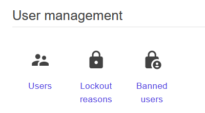

# Adding dashboard items

Sienar enables deverlopers to create dashboards for their plugins (or alter dashboards for other plugins) with the `IDashboardProvider` interface.

**NOTE**: A lot of the information contained in this guide assumes knowledge of several menu-related classes discussed in the previous section. If you haven't already, please read our guide on [adding menu items](/devs/guides/plugin-providers/adding-menu-items) before continuing.

## Overview

In Sienar, a "dashboard" is similar to a navigation menu. However, instead of displaying links in sidebars or appbars, a dashboard shows links grouped by category, like an app dashboard. A good example of the kind of experience you get with a Sienar dashboard is the admin interface of a cPanel application or similar, which has page-wide sections of links organized into groups.

A dashboard is more appropriate when you have a large number of items to display because dashboards have the entire page width to render, plus unlimited vertical space.

### `IDashboardProvider`

The `IDashboardProvider` is used to configure dashboards. It's very similar to the `IMenuProvider` used to configure menus - in fact, both implementations are identical, just with different generic parameters (`DashboardLink` for dashboards, `MenuLink` for menus). The primary difference in dashboard usage is that instead of accessing named *menus*, each call to the `Access()` accesses a named *dashboard section*. When displaying dashboards using the `<Dashboard>` component, you need to provide a `List<string>` to the `Dashboard.Categories` parameter, which renders each given named dashboard section in definition order.

### `LinkDictionary<DashboardLink>`

This is the same `LinkDictionary<T>` class used in menus, with the exception that the generic parameter is a `DashboardLink` instead of a `MenuLink`.

### `MenuPriority`

Just like with menus, the `MenuPriority` enum lets Sienar know what order to render your dashboard links in. Because sections are named based on the string provided to `IDashboardProvider.Access()`, sections are sorted by changing the order of dashboard section names passed to the `Dashboard.Categories` parameter.

### `DashboardLink`

The `DashboardLink` class is the base class for the `MenuLink` used in menus. It works nearly identically in both menus and dashboards. The only difference is that `DashboardLink` doesn't have the `Sublinks` property.

## Examples

The core functionality of adding menu links and dashboard links is almost identical - different interfaces are used, but the classes implementing those interfaces are essentially identical. The `DashboardLink` class is even the base class of the `MenuLink` class. The only real usage differences are:

- instead of adding links to named menus, you add links to named dashboard sections
- the `DashboardLink` class doesn't have a `Sublinks` property

Because the API is almost identical, we're only going to show a single example that demonstrates the differences between usages in menus and dashboards. See the previous article for more complete coverage of the API.

### Example 1: Adding a dashboard item

In this example, we will add a single dashboard item to the existing User Management dashboard section. The link will point to a fictional page that shows a listing of all banned users.

Before adding the icon, we see that the User Management dashboard section contains the following two links:


```csharp
using Sienar.Infrastructure; // Import DashboardMenuNames and Roles classes
using MudBlazor; // Import MudBlazor's Icons class

// ...

public void Execute()
{
	_provider
    	.Access(DashboardMenuNames.Dashboards.UserManagement)
    	.AddLink(
			new DashboardLink
    		{
                Text = "Banned users", // Display text
                Icon = Icons.Material.Filled.LockPerson, // Link icon
                Url = "/dashboard/users/banned", // URL of page
                Roles = [Roles.Admin] // Only available to admins
			});
}
```

Now, if we build and run our application, we can see that there is a new dashboard item:

