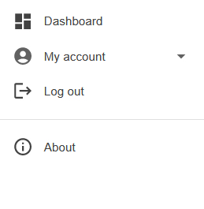
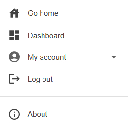
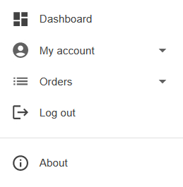
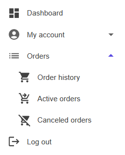
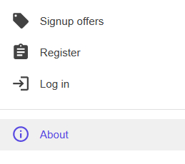
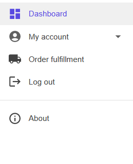
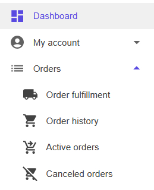

# Adding menu items with `IMenuProvider`

Sienar enables developers to create menus for their plugins (or alter menus for other plugins) with the `IMenuProvider` interface.

## Overview

In Sienar, a "menu" is semantically identical to a website navigation menu. It may appear horizontally across the top of a page or vertically within a sidebar. Each menu has a unique string name, which can be used to access that menu from different plugins or even from Blazor components.

A menu is typically appropriate when you have a limited number of items to display, as menus tend to have limited space available to them. 

### `IMenuProvider`

The `IMenuProvider` acts as a container for named menus. It's backed by a `Dictionary<string, LinkDictionary<MenuLink>>` and has a single public method, `Access(string)`. The `Access()` method's string argument is the unique name of the menu you're trying to modify. Calling `Access(menuName)` will create a `LinkDictionary<MenuLink>` for that name if it doesn't exist, then return the `LinkDictionary<MenuLink>`.

### `LinkDictionary<MenuLink>`

The `LinkDictionary<MenuLink>` class extends `Dictionary<MenuPriority, List<MenuLink>>` and adds a single public method of its own, `Menu AddLink(MenuLink, MenuPriority)`. Like the `IMenuProvider`, this method checks if the dictionary contains a key for that `MenuPriority`, and if it doesn't, creates a new `List<MenuLink>` in the dictionary at that `MenuPriority` before adding the specified `MenuLink` to the list. The `AddLink()` method is fluent, so you can chain multiple calls.

### `MenuPriority`

The `MenuPriority` enum is a way to let Sienar know the render priority you want to give the menu link you're adding. It has five values: `Lowest`, `Low`, `Mid`, `High`, and `Highest`. The lower the menu priority value, the further down in the menu the `MenuLink` will be rendered (e.g., a `MenuLink` with `MenuPriority.High` will render before a `MenuLink` with `MenuPriority.Mid`). Menu links with the same priority will be rendered in the order they were registered. **NOTE**: All of Sienar's links are added with `MenuPriority.Mid`, so you can place your links either before or after Sienar's links if you wish.

### `MenuLink`

The `MenuLink` class contains the data for each menu link to be rendered, including a `List<MenuLink> Sublinks` property which contains nested links. Nested links are rendered in an accordion-style component, with the parent `MenuLink` being rendered as the activator of the accordion. For more information on the `MenuLink` class, see its [API documentation](/devs/api/MenuLink).

## Examples

In each of our examples, we will add a menu item to one of Sienar's menus. The process is the same to add menu items to one of your own menus - all you need to change is the menu name.

Our examples assume that they are executing on Sienar dashboard pages. If you're following along with your own custom plugin, you can either configure your plugin to execute on `/dashboard` endpoints by following our guide on [configuring plugins to execute on the Sienar dashboard](/), or you can use the default implementation of `ISienarPlugin.ShouldExecute()`, which always returns `true` and guarantees that your plugin executes on every request.

For reference, the main Sienar menu looks like this prior to any changes in this guide:



### Example 1: Adding a simple menu link

For our first example, we'll add a "go home" link to the Sienar dashboard menu. That way, users can always find their way back to your homepage, no matter where they are.

To add a go home link, access the Sienar main menu dashboard and add a new menu link with text `Go home`, a URL of `/`, and an icon of `Icons.Material.Filled.House`:

```csharp
using Sienar.Infrastructure; // Imports DashboardMenuNames class
using MudBlazor; // Imports Icons class

// ...

public void Execute()
{
	_provider
		.Access(DashboardMenuNames.MainMenu)
		.AddLink(
			new MenuLink()
			{
				Text = "Go home",
				Icon = Icons.Material.Filled.House,
				Url = "/"
			},
			MenuPriority.Highest); // Ensures this item goes first
}
```

After adding the go home link, the main menu now looks like this:



### Example 2: Adding a menu link with sublinks

For our second example, we'll make things a little more interesting and add a menu link with sublinks.

Let's imagine you've built an online shop. Your users will need to see their order history, a list of active orders that haven't yet arrived, and perhaps a list of orders they've canceled. We'll need to add three links for those pages: `Order history`, `Active orders`, and `Canceled orders`. But since all of these links are related, we should add them under a parent link simply called `Orders`. To accomplish this, add the following code:

```csharp
using Sienar.Infrastructure; // Imports DashboardMenuNames class
using MudBlazor; // Imports Icons class

// ...

public void Execute()
{
	_provider
		.Access(DashboardMenuNames.MainMenu)
		.AddLink(
			new MenuLink()
			{
				Text = "Orders",
				Icon = Icons.Material.Filled.List,
				Sublinks =
				[
					new MenuLink()
					{
						Text = "Order history",
						Icon = Icons.Material.Filled.ShoppingCart,
						Url = "/dashboard/orders"
					},
					new MenuLink()
					{
						Text = "Active orders",
						Icon = Icons.Material.Filled.ShoppingCartCheckout,
						Url = "/dashboard/orders/active"
					},
					new MenuLink()
					{
						Text = "Canceled orders",
						Icon = Icons.Material.Filled.RemoveShoppingCart,
						Url = "/dashboard/orders/canceled"
					}
				]
			});
}
```

That's a lot of code, so let's break it down.

First, notice that we only actually called `AddLink()` once, with the parent link. That's because the other links are added as sublinks of the parent `Orders` link since we want the `Orders` link to serve as a dropdown that contains the other links.

Second, notice that each sublink is just an instance of `MenuLink`. There's nothing special about these instances, except that they're stored on the `Sublinks` property of the parent link.

Third, notice that the parent `MenuLink` doesn't have a `Url` value. This is because the parent `MenuLink` doesn't actually go anywhere - it's just a container for the sublinks, so it doesn't need a URL.

Now that those points are out of the way, you can see that this example is otherwise identical to the first example - we created a link, added some display text, added an icon, and added a URL. The only difference is that we did it four times in this example, and we created a parent-child relationship between our links so they render as a submenu.

If you were to run this example, you would see that there is now an `Orders` menu item right below `My account`:



And you would notice that you can expand that menu to reveal the three sublinks we created:



The reason the `Orders` menu renders before the `Logout` button is that Sienar adds the `Logout` button with `MenuPriority.Lowest`, so you can render your items before the `Logout` button by setting any priority other than `MenuPriority.Lowest` (if you don't supply a priority as the second argument of `IMenuProvider.AddLink()`, `MenuPriority.Mid` is the default).

It's all looking good so far! There's just one problem with this menu: it displays *even if you're logged out*.

### Example 3: Adding login verification to Example 2

`MenuLink` has a property that will allow us to make example 2's `Orders` menu only appear for logged in users with ease: `MenuLink.RequireLoggedIn`, which is a `bool`. If `true`, the menu link won't render (nor will its sublinks).

To make this change to your code, all you need to do is add `RequireLoggedIn = true` to the parent `MenuLink` above:

```csharp
using Sienar.Infrastructure; // Imports DashboardMenuNames class
using MudBlazor; // Imports Icons class

// ...

public void Execute()
{
	_provider
		.Access(DashboardMenuNames.MainMenu)
		.AddLink(
			new MenuLink()
			{
				Text = "Orders",
				Icon = Icons.Material.Filled.List,
+				RequireLoggedIn = true, // Add this line
				Sublinks =
				[
					new MenuLink()
					{
						Text = "Order history",
						Icon = Icons.Material.Filled.ShoppingCart,
						Url = "/dashboard/orders"
					},
					new MenuLink()
					{
						Text = "Active orders",
						Icon = Icons.Material.Filled.ShoppingCartCheckout,
						Url = "/dashboard/orders/active"
					},
					new MenuLink()
					{
						Text = "Canceled orders",
						Icon = Icons.Material.Filled.RemoveShoppingCart,
						Url = "/dashboard/orders/canceled"
					}
				]
			});
}
```

Now, if you were to run this example again, you would see that if you log out of your account, the `Orders` menu and its sublinks no longer render. Sublinks don't render because if a user doesn't pass the `MenuLink` authorization requirements, its sublinks aren't even processed.

### Example 4: Adding a logged out verification

Sometimes, you want a menu item to appear only to users that are *not* authorized (for example, a login link). Continuing with our fictional storefront, we will add a new menu item that shows users a `Signup offers` link, but only if they're logged out. This is similar to the previous example, but instead uses the property `MenuLink.RequireLoggedOut`. For brevity, the previous example code is omitted.

```csharp
using Sienar.Infrastructure; // Imports DashboardMenuNames class
using MudBlazor; // Imports Icons class

// ...

public void Execute()
{
	_provider
		.Access(DashboardMenuNames.MainMenu)
		.AddLink(
			new MenuLink()
			{
				Text = "Signup offers",
				Icon = Icons.Material.Filled.LocalOffer,
				RequireLoggedOut = true,
				Url = "/dashboard/new-user-offers"
			});
}
```

Now, if you're logged in, you don't see a `Signup offers` menu item. However, if you log out, you see it as expected:



### Example 5: Adding role verification

For many parts of your app, you may want more strict requirements than just requiring a user to be logged in. Many parts of Sienar, for example, are reserved for users in the `Administrator` role. As it happens, our fictional storefront also has one such page: the order fulfillment page.

We need to create a link to a page with the text `Order fulfillment` that requires a user to be in the `Administrator` role. To do that:

```csharp
using Sienar.Infrastructure; // Imports DashboardMenuNames class
using MudBlazor; // Imports Icons class

// ...

public void Execute()
{
	_provider
		.Access(DashboardMenuNames.MainMenu)
		.AddLink(
			new MenuLink()
			{
				Text = "Order fulfillment",
				Icon = Icons.Material.Filled.LocalShipping,
				Roles = [Roles.Admin],
				Url = "/dashboard/orders/fulfillment"
			});
}
```

Everything looks pretty much the same as other examples, with one new property used: `MenuLink.Roles`, which is an `IEnumerable<string>`. When you add role names to this property, the `IMenuGenerator` verifies that the current user is in those roles before showing the menu item.

You might also notice that this `MenuLink` doesn't check that the user is logged in. `IMenuGenerator` uses `IUserAccessor` under the hood, which doesn't require a user to be logged in to perform checks against the user. You only need to supply the most strict requirements to your `MenuLink` if you use the default `IUserAccessor` supplied by Sienar.

If you re-compile and run your app, you'll see that if you're not logged in as an administrator, you won't see anything. But if you are, you'll see the `Order fulfillment` link in the menu:



### Example 6: Verifying against multiple roles

Expanding the previous example, how would you verify that a user was in multiple roles? We touched on this briefly. The `MenuLink.Roles` property is an `IEnumerable<string>`, which contains the role names that a user must be in in order to view that link. If there is more than one role in the `MenuLink.Roles` property, then by default, the `IMenuGenerator` will exclude that link if the current user isn't in every role listed.

In our fictional storefront, if you have a dedicated role for users who ship orders, you can add that role to the `MenuLink.Roles` property in addition to the Sienar `Administrator` role:

```csharp
using Sienar.Infrastructure; // Imports DashboardMenuNames class
using MudBlazor; // Imports Icons class

// ...

public void Execute()
{
	_provider
		.Access(DashboardMenuNames.MainMenu)
		.AddLink(
			new MenuLink()
			{
				Text = "Order fulfillment",
				Icon = Icons.Material.Filled.LocalShipping,
				Roles = [Roles.Admin, "Shipper"],
				Url = "/dashboard/orders/fulfillment"
			});
```

Now, the current user must be *both* an `Administrator` **and** a `Shipper` in order to view the `Order fulfillment` link.

### Example 7: Verifying against one of multiple roles

Our previous example shows how to require a user to be both an `Administrator` and a `Shipper` in order to see the `Order fulfillment` link. This might make sense for small organizations where fulfillment is probably handled by a manager or owner, but this doesn't work in larger organizations where fulfillment is handled by an employee because your employee would have to be granted `Administrator` access just to ship orders - and you certainly don't want that! So as a responsible web administrator, you want *either* `Administrator` **or** `Shipper` users to have access to order fulfillment. So how do you do that in Sienar?

Sienar makes this very straightforward with the usage of the `MenuLink.AllRolesRequired` property, which is a `bool`. If `false`, then `MenuLink.Roles` no longer requires a user to fulfill **all** roles listed - instead, it only requires users to fulfill **any** role listed. The only change needed to enable this functionality is adding `AllRolesRequired = false` to the previous example:

```csharp
using Sienar.Infrastructure; // Imports DashboardMenuNames class
using MudBlazor; // Imports Icons class

// ...

public void Execute()
{
	_provider
		.Access(DashboardMenuNames.MainMenu)
		.AddLink(
			new MenuLink()
			{
				Text = "Order fulfillment",
				Icon = Icons.Material.Filled.LocalShipping,
				Roles = [Roles.Admin, "Shipper"],
				AllRolesRequired = false,
				Url = "/dashboard/orders/fulfillment"
			});
```

Now, if a user is *either* an `Administrator` **or** a `Shipper`, they will be authorized to view the link.

### Example 8: Adding sublinks with different authorization requirements

In many apps, there are areas that have pages with varying requirements to view. For example, our `Orders` menu from a few examples back had several sublinks, but they all inherited their authorization requirements from the parent `Orders` menu link - but then, for the last few examples, we started working with an `Order fulfillment` link, which should probably go under the `Orders` menu, right?

In Sienar, we can do this easily. All you need to do is include an item as a sublink, then add its requirements as usual. The sublink will not render at all if the parent link's authorization requirements are not met, but even if the parent *does* render, the user must still pass the sublink's own authorization requirements. We can combine the code from examples 3 and 7 to see how this works:

```csharp
using Sienar.Infrastructure; // Imports DashboardMenuNames class
using MudBlazor; // Imports Icons class

// ...

public void Execute()
{
	_provider
		.Access(DashboardMenuNames.MainMenu)
		.AddLink(
			new MenuLink()
			{
				Text = "Orders",
				Icon = Icons.Material.Filled.List,
				RequireLoggedIn = true,
				Sublinks =
				[
					new MenuLink()
					{
						Text = "Order fulfillment",
						Icon = Icons.Material.Filled.LocalShipping,
						Roles = [Roles.Admin, "Shipper"],
						AllRolesRequired = false,
						Url = "/dashboard/orders/fulfillment"
					},
					new MenuLink()
					{
						Text = "Order history",
						Icon = Icons.Material.Filled.ShoppingCart,
						Url = "/dashboard/orders"
					},
					new MenuLink()
					{
						Text = "Active orders",
						Icon = Icons.Material.Filled.ShoppingCartCheckout,
						Url = "/dashboard/orders/active"
					},
					new MenuLink()
					{
						Text = "Canceled orders",
						Icon = Icons.Material.Filled.RemoveShoppingCart,
						Url = "/dashboard/orders/canceled"
					}
				]
			});
```

In the code snippet above, you can see that the `Orders` menu link from Example 3 has been added back. But its sublinks has a new link: the `Order fulfillment` link as finalized in Example 7. If the user isn't logged in, the `Orders` menu link will not render at all. If the user *is* logged in, but *isn't* an `Administrator` or `Shipper`, then the user will see all the `Orders` sublinks *except* `Order fulfillment`. If the user is either an `Administrator` or `Shipper`, the user will see all the sublinks.

If the user is an administrator or shipper:



However, if the user is not an administrator or shipper, but is still logged in:

